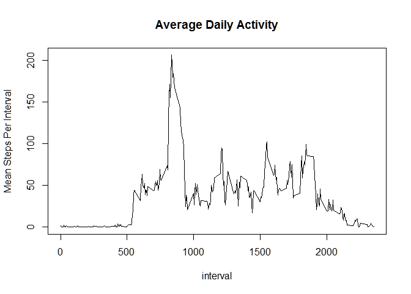

# Reproducible Research: Peer Assessment 1


## Loading and preprocessing the data
First: Read the file into a variable. Assume activity.zip file is in working directory. "unz" will unzip the file

```r
s<- read.table(unz('activity.zip','activity.csv'), header=T, quote="\"", sep=",")
```
File is already in a suitable format for analysis

## What is mean total number of steps taken per day?
Total Steps each day:

```r
aggregate(steps~date,data=s,FUN=sum)
```

```
##          date steps
## 1  2012-10-02   126
## 2  2012-10-03 11352
## 3  2012-10-04 12116
## 4  2012-10-05 13294
## 5  2012-10-06 15420
## 6  2012-10-07 11015
## 7  2012-10-09 12811
## 8  2012-10-10  9900
## 9  2012-10-11 10304
## 10 2012-10-12 17382
## 11 2012-10-13 12426
## 12 2012-10-14 15098
## 13 2012-10-15 10139
## 14 2012-10-16 15084
## 15 2012-10-17 13452
## 16 2012-10-18 10056
## 17 2012-10-19 11829
## 18 2012-10-20 10395
## 19 2012-10-21  8821
## 20 2012-10-22 13460
## 21 2012-10-23  8918
## 22 2012-10-24  8355
## 23 2012-10-25  2492
## 24 2012-10-26  6778
## 25 2012-10-27 10119
## 26 2012-10-28 11458
## 27 2012-10-29  5018
## 28 2012-10-30  9819
## 29 2012-10-31 15414
## 30 2012-11-02 10600
## 31 2012-11-03 10571
## 32 2012-11-05 10439
## 33 2012-11-06  8334
## 34 2012-11-07 12883
## 35 2012-11-08  3219
## 36 2012-11-11 12608
## 37 2012-11-12 10765
## 38 2012-11-13  7336
## 39 2012-11-15    41
## 40 2012-11-16  5441
## 41 2012-11-17 14339
## 42 2012-11-18 15110
## 43 2012-11-19  8841
## 44 2012-11-20  4472
## 45 2012-11-21 12787
## 46 2012-11-22 20427
## 47 2012-11-23 21194
## 48 2012-11-24 14478
## 49 2012-11-25 11834
## 50 2012-11-26 11162
## 51 2012-11-27 13646
## 52 2012-11-28 10183
## 53 2012-11-29  7047
```

Histogram of the steps per day:

```r
perDay<-aggregate(steps~date,data=s,FUN=sum)
hist(perDay$steps, breaks=10, main="Histogram of steps per day", xlab="steps")
```

<!-- -->

Mean of total steps for each day:

```r
mean(perDay$steps)
```

```
## [1] 10766.19
```

Median of total steps per day:

```r
median(perDay$steps)
```

```
## [1] 10765
```


## What is the average daily activity pattern?
Calculate the average steps for each 5 minute interval and plot the results:

```r
perMin<-aggregate(steps~interval,data=s,FUN=mean)
plot(perMin,ylab="Mean Steps Per Interval", main="Average Daily Activity", type="l")
```

<!-- -->

Find interval with biggest average steps:

```r
BigAvg<- perMin[perMin$steps==max(perMin$steps),]$interval
```

The value of BigAvg is printed inline on the next line:

Interval number 835 has the largest average 

## Imputing missing values

How many rows have missing values?

```r
nrow(s[is.na(s$steps),])
```

```
## [1] 2304
```

To impute missing values we will replace NA with the average value for that interval.

merge s and perMin and then update any NA values in steps with the average interval value

```r
sI<-merge(x=s,y=perMin,by="interval")
for(i in 1:nrow(sI)){ if(is.na(sI[i,]$steps.x)) sI[i,]$steps.x = sI[i,]$steps.y}

perDayI<-aggregate(steps.x~date,data=sI,FUN=sum)
hist(perDayI$steps.x,breaks=10)
```

<!-- -->

Not much impact when fixing missing values...

Mean with imputed data:

```r
mean(perDayI$steps.x)
```

```
## [1] 10766.19
```

Median with imputed data: 

```r
median(perDayI$steps.x)
```

```
## [1] 10766.19
```

There is basically no difference between the mean with the original data and the mean with the imputed data

## Are there differences in activity patterns between weekdays and weekends?


Code dates as weekdays or weekends:

```r
sI$dayType='unknown'
for(i in 1:nrow(sI)){ if(weekdays(as.POSIXct(sI[i,]$date)) %in% c('Saturday','Sunday')) {sI[i,]$dayType='weekend'}else {sI[i,]$dayType='weekday'}}
```

Get interval averages for weekdays and for weekends:

```r
perMinIWeekday<-aggregate(steps.x~interval,data=sI[sI$dayType=='weekday',], FUN=mean)
perMinWeekend<- aggregate(steps.x~interval,data=sI[sI$dayType=='weekend',], FUN=mean)
```

Plot the datasets:

```r
par(mfcol=c(2,1))
plot(perMinIWeekday$interval,perMinIWeekday$steps.x, type="l", ylab="Weekday Steps", main="steps per 5 min interval")
plot(perMinWeekend$interval,perMinWeekend$steps.x, type="l", ylab="weekend steps")
```

<!-- -->
